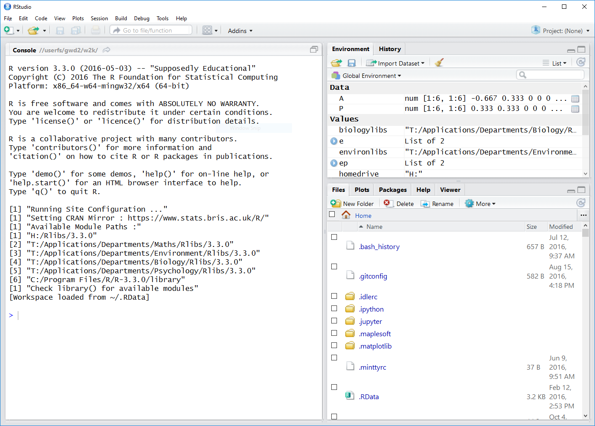

```{r setup, include=FALSE}
knitr::opts_chunk$set(echo = TRUE, comment=NA)
```

## Getting Started

To interface with the programming language R we shall use a program called RStudio. On a campus PC you can launch RStudio by typing 'RStudio' into the search box on the start menu, and clicking on `RStudio'. This brings up a window like the one shown below.


<br><br>

The upper right panel contains your *Enviroment* and *History*. The lower right panel has many tabs, including *Plots* -which shows the plots you generate. The left panel is called the *Console*. When you launch RStudio, lots of information will be displayed here, most of which you can ignore. Below this information is the *prompt*, where you input commands. For example, try typing the command

```{r results='hide', message=FALSE, warning=FALSE}
7+2
```

after the > on the console, and pressing enter, this gives the output


```{r echo=FALSE}
7+2
```

So far so good.


We shall use the `<-` notation to create a variable with this value:

```{r}
x <- 7+2
```

This creates a variable `x` which is assigned the value `9`. Let us square this variable:

```{r}
x^2
```

Before we continue learning basic commands, let us learn about script files so we can keep a better record of our work.

##R Script Files

Although one can do a lot by typing or pasting commands into the console, it is 
more convenient to work with R script files. An R script file is simply a text 
file that contains the commands that you want R to  execute. The advantage of 
typing the R commands into the script file and executing them from there rather 
than typing them  straight into the console is that in the script file 
you can lay out your calculations in an understandable way and you can 
revisit your calculations easily later to build on them
or to share them with others.

The first step is to create a new R script file. To do that you click 
on the left-most icon on the toolbar at the top of
the RStudio window, the one that looks like a piece of paper with a 
plus sign. That opens a drop-down menu. The top entry is
``R script'' and is the one you want to select. This will open an 
editor panel above your console with a new empty text file.
That is where you will type in the R commands for this lab.

To execute commands from an R script you can highlight them and click 
`Run' (or hold Ctrl and press Enter). This has the same effect as 
these commands at the prompt.

I recommend that you save the R script file frequently by clicking
on the floppy disk icon on the toolbar. The first time you save the
document you will be prompted to choose a location. Please create a
folder where you will keep all the documents related to this module.
If you are on a campus PC and save the document to your H: drive then 
will be able to access it from any other campus PC or even from your home
PC. For details see <http://www.york.ac.uk/it-services/it/filestore/>
for more details.

This lab will ask you to perform some small tasks as you work through.
Please put all the commands for completing those tasks into your
R script file and commit that file to your Github repository as
a record of what you have done. (The use of Github will be discussed
at our second session.)

## Basic Commands

R has various built in functions that can be useful for calculations. For 
example, we can define a variable `y` that is the square root of 1.21 using the 
command:

```{r}
y <- sqrt(1.21)
```

Since this is a definition, R does not print the value of `y`, however one may 
print the value of `y`, simply using the command:

```{r}
y
```

There is a range of mathematical functions, for example:

* abs, sign, sqrt, floor, ceiling, trunc, round, signif
* exp, log, expm1, log1p,
* cos, sin, tan, cospi, sinpi, tanpi, acos, asin, atan
* cosh, sinh, tanh, acosh, asinh, atanh
* lgamma, gamma, digamma, trigamma
* cumsum, cumprod, cummax, cummin

and also a range of mathematical operators:

* +, -, *, /, ^, %%, %/%
* &, |, !
* ==, !=, <, <=, >=, >

You can use the R help to find out more about these. As you may already have
noticed, as you start typing a function name, RStudio starts to suggest
possible completions, so that you do not have to type the whole function
name but can simply hit Tab. RStudio also starts to display some information
about the function. To get to the full help page for the function you just
have to hit the F1 key and the help page will open in the Help browser.

R also includes definitions of mathematical constants like $\pi.$

```{r}
pi
```

### Exercise 1
Let $s = \sin(\pi/3) + \log(3).$ Is it true that $s^4/2 \geq e^s$?


R supports complex arithmetic. Let us define two complex numbers, a and b.

```{r}
a <- 1+2i
b <- 1i
```
Note how `i`, the square root of negative one, is used to represent complex 
numbers and how just `i` by itself has to be written as `1i`. R can use complex 
arithmetic to determine the ratio of these two complex numbers:

```{r}
a/b
```
Some additional functions for working with complex numbers are: 

* Arg, Conj, Im, Mod, Re

For example the complex conjugate of `a` can be found using

```{r}
Conj(a)
```

## Vectors

In R the term 'vector' means an ordered list of elements in the same class,
hence even the command

```{r}
1.5
```

refers to a vector. It is just a numeric vector with only one entry. 
The command `c()` concatenates together vectors to make larger vectors. We give 
examples of the five main types of vectors below:

A 'numeric' vector:
```{r}
c(0.5, 0.7)
```

A 'logical' vector:
```{r}
c(TRUE, FALSE) 
```

A 'character' vector:
```{r}
c("dog","cat","chicken") 
```
 
An 'integer' vector:
```{r}
9:12 
```

A 'complex' vector:
```{r} 
c(1+0i, 2+4i) 
``` 


R can perform many mathematical operations on two vectors of the same length, by 
performing the operations upon corresponding components, for example:

```{r} 
x <- c(2, 4, 8, 16)
x + (1:4) 
``` 

```{r} 
x / (1:4) 
``` 

If one of the vectors is smaller than the other, R recycles the entries of the 
shorter vector to make it into the same length as the longer vector:
```{r} 
x + c(10, 200)
``` 

```{r} 
x + 10
``` 
It gives a warning if the length of the longer vector is not an integer multiple
of the length of the shorter vector but still does the calculation:

```{r} 
x + c(10, 200, 3000)
``` 
When one tries to do an operation upon two vectors of different classes, R will 
try and re-express the objects in a class where the operations can be resolved. 
This can lead to a change in data structure called 'coercion':

```{r} 
c(2.2, 4, 8)*c(TRUE, FALSE, FALSE) 
``` 

Here the two vectors are multiplied component wise, with the second vector being 
represented as a numeric vector, where `FALSE` is represented by 0, and `TRUE` 
is represented by 1.

The command `seq(a, b, length.out = n)` creates a length n vector of numbers, 
evenly spaced, between `a` and `b`, for example:
```{r} 
seq(0, 2, length.out = 5)
```

This vector can be created in another way, by specifying the increment (0.5) 
between successive entries, rather than the vector length:

```{r} 
seq(0, 2, by = 0.5)
```

Using a negative increment one may define descending sequences:

```{r} 
seq(0, -2, by = -0.5)
```

Elementary mathematical functions ($\sin, \cos, \exp, \log$, etc.) operate on 
vectors term by term, for
example:

```{r} 
x <- seq(0, 2, by = 0.5)
sin(x)
```

The $n$th entry of a vector is described by `x[n]`. The indexing starts at 1.

```{r} 
x[1]
x[2]
```
Let's display a long vector
```{r}
1:50
```
Now we can finally understand the number in the square brackets that R displays
at the start of a line when it outputs a vector. It is the index of the vector
entry that is printed first on that particular line. When R displays a number,
i.e., a vector of length 1, that information is a bit unnecessary, but when
it displays long vectors it becomes important.

### Exercise 2
Create a vector $t$ with 10 elements 1,2,3,...,10. Compute $t \cos t$ and 
$t^2 e^{-t}$ for $t=1,\dots,10$.

### Exercise 3
The sum of the geometric series $1+r+r^2+r^3+...+r^n$ converges to the limit 
$\frac{1}{1-r}$ as $n \rightarrow \infty$. 

1. Create a vector $n$ with 11 elements 0,1,2,3,...,10. 
2. Take r=0.5 and create another vector $x =[r^0, r^1, r^2, ..., r^n]$ using the 
command `x <- r^n`. 
3. Calculate the sum of the elements of this vector using the command `sum(x)` 
and compare it with the limit $\frac{1}{1-r}$. 
4. Repeat the procedure for n from 0 to 20.


## Matrices


A matrix in R is a vector, together with a specification of the number of rows 
(`nrow`) and the number of columns (`ncol`).

```{r} 
A <- matrix(c(1,2,1,2,3,1,4,2,1), nrow=3, ncol=3)
A
```

The matrix entry in the `i`th row and the `j`th column is denoted `A[i,j]`, 
for example:  

```{r} 
A[2,3]
```

We can rewrite an element using:

```{r} 
A[2, 3] <- 7
A
```

Any sub-matrix of A can be obtained by using range specifiers for row and column indices:

```{r} 
B <- A[1:2, 1:3]
B
```

```{r} 
B <- A[2:3, 2:3]
B
```


The transpose of matrix `A` is given by `t(A)`

```{r} 
B <- t(A)
B
```


The command `rbind(A, u)` appends the vector `u` to the rows of `B`:

```{r} 
u <- c(1, 1, 5)
B <- rbind(A, u, deparse.level=0)
B
```

The `deparse.level=0` part of the above command is not essential, but it is cleaner because without it the newly added row is given a different label.

The command `cbind(A, v)` appends the vector `v` to the columns of `B`:

```{r} 
v <- c(2, 2, 5)
B <- cbind(A, v, deparse.level=0)
B
```

An `n` by `n` matrix with ones on the diagonal and zeroes elsewhere can be created using the command `diag(n)`, for example:

```{r} 
B <- diag(2)
B
```

The command `matrix(v, n, m)` generates an `n` by `m` matrix with each entry equal to `v`. So a 2 by 2 matrix of zeroes can be generated by:

```{r} 
B <- matrix(0, 2, 2)
B
```


The first column can be replaced by twos by the command:
```{r} 
B[, 1] <- c(2, 2)
B
```

If `A` and `B` are matrices with the same number of rows and columns then `A+B` is obtained via component wise addition:

```{r} 
A <- matrix(c(1,1,2,3), nrow=2, ncol=2)
B <- matrix(1, 2, 2)
A+B
```

In this case `A*B` is the matrix obtained by performing component wise multiplication. 

```{r} 
A * B
```

To perform true matrix multiplication one uses the command:

```{r} 
A %*% B
```

Let us specify the vector:

```{r} 
x <- c(2, 1)
```

In R one does not need to distinguish between row and column vectors. If we use the matrix multiplication (`%*%`) command with `x` on the right of a matrix, then `x` is treated as a column vector:

```{r} 
A %*% x
```

If `x` is on the left of the matrix it is treated as a row vector:

```{r} 
x %*% A
```

Note that in each case the output is a matrix (i.e., a vector plus a specification of the number of rows and columns). One can use the `as.vector` command to remove this extra data, and simply return the vector of entries. 

```{r} 
as.vector(x %*% A)
```

The solution `X` of the matrix equation `AX=b` can be computed by the command `solve(A,b)`, for example for the matrix:

```{r} 
A <- matrix(c(1,2,1,2,1,1,3,1,1), nrow=3, ncol=3)
A
```
and the vector
```{r} 
b <- c(2,2,1)
```
we have
```{r} 
solve(A,b)
```

### Exercise 4
Solve the system of linear equations
$$\left(\begin{array}{cccc}
1 & -2 & 3 & 5\\
-2 & 1 & 1 & 1\\
-1 & 3 & 1 & -4\\
1 & 1 & 1 & 7
\end{array}\right)
\left(\begin{array}{c} x_{1} \\ x_{2} \\ x_{3} \\ x_{4} \end{array}\right)
=\left(\begin{array}{c} -4 \\ 5 \\ 13 \\ -4 \end{array}\right)$$


## Basic Plotting

To make the plot of a function, we first create a vector of $x$ values and
then a vector of corresponding $y$ values lying on the graph of the function.
```{r}
x <- seq(0, 1, by=0.01)
y <- sin(4*pi*x)
```
Then we give these vectors to the plot function.
```{r}
plot(x, y)
```

Make sure the 'Plots' tab in the bottom right panel is selected, to see the 
circle plot.

By default the plot command then draws a circle at each of those points. To get 
a more traditional line plot we specify the type of plot via the 'type' argument:
```{r}
plot(x, y, type="l")
```

We can use a similar method to create a picture of a circle. First we create a
linearly spaced vector consisting of 100 angles:

```{r} 
theta=(0:100)*2*pi/100
```

Then we calculate the x and y coordinates of points on the circle:

```{r} 
x <- cos(theta)
y <- sin(theta)
```

Now we shall plot the circle. R does not give the axes the same length by 
default, and so to obtain a square plot we need to change the plot parameters 
using the `par(pty="s")` command before we use the plot command. After making 
the plot we change the plotting parameters back to their default settings using 
the `par(pty="m")` command.


```{r} 
par(pty="s")
plot(x, y, main="A circle", xlab="X", ylab="y")
par(pty="m")
```


### Exercise 5

Use on-line help for R plot, to change the colour of the graph of unit 
circle. To ask R for help press F1 when the cursor is on the desired command.


## More Resources

That was a short introduction to R and RStudio, but we will provide you with 
more functions and a more complete sense of the language as the course
progresses. Feel free to browse around the websites for R
<http://www.r-project.org> and RStudio <http://rstudio.org> if you are 
interested in learning more.

If you would like to work on your own computer, you can download and install 
R from <http://cran.rstudio.com/> and then download and install RStudio from
<http://www.rstudio.com/products/rstudio/download/>. Both are free and open-source and available for Windows, Mac and Linux. It is also possible to 
R from within a browser window in case you find yourself on a computer that
does not have R installed. The best option for that is probably the
<https://cloud.sagemath.com/> which offers an online notebook interface not
only to R but also to Sage (an open source alternative to Maple) and many
other tools useful for mathematicians.

