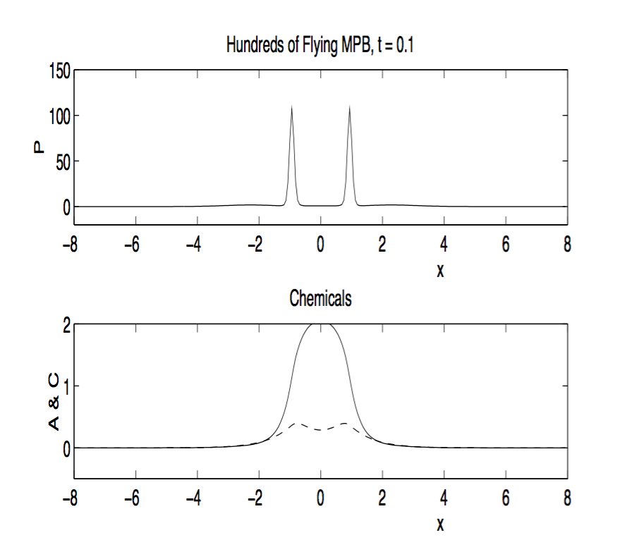

```{r setup, include=FALSE}
knitr::opts_chunk$set(echo = TRUE)
```

## Introduction

Mountain pine beetles are a species of bark beetle native to western North America, which invade and destroy lodgepole pine forests. Originally a beneficial part of a forest's ecological succession, changing climate has increased the beetle's populations to the point where they are now considered pests and can significantly damage the forests. Understanding the spatial movement of these beetles as they invade a lodgepole forest is crucial to understanding the ecological disturbance the beetles create. In the paper 'Invasion of lodgepole forests by mountain pine beetles' by Peter White and James Powell (1996), White and Powell developed a system of six partial differential equations to map the spatio-temporal dynamics of a mountain pine beetle outbreak. They used Adams-Bashforth and central difference methods to obtain numerical approximations to the solution. 

In this project, I will explore the model used by White and Powell (1996) using the method of lines to reduce the system of PDEs to a system of ODEs, with a central difference method approximating the space derivatives. The goal is to observe the mountain pine beetle population moving in a wave from the center of the forest, as shown in the original paper, along with the dynamics of the chemicals produced by the beetles and trees. For simplification, I examine these dynamics in only one spatial direction, $x$, and in only one direction of x (e.g. moving from the center of the forest to the right in the x-direction rather than to both the left and the right).

**GWD: the proper way to reduce a two-dimensional problem to a one-dimensional problem when one is only interested in radially symmetric solutions is described in Example 2.3 in the notes. Note the appearance of an extra drift term. However for this project I had asked you to simply use the one-dimensional version of the equations, as you are doing.**

## Anticipated problems and potential solutions

The system examined here is stiff and highly complex, with six linked equations. As a result, using a method such as the explicit forward difference method for the time derivatives would require very small time steps in order to obtain a viable solution, but the small time step would result in significant noise elsewhere in the system due to stiffness. Instead, I will use the method of lines, which allows a discretization in the $x$ direction - the space component - but treats $t$, the time component, as continuous. By using continuous time, the system can be reduced to one of ODEs, which can be easily solved by R using the deSolve package. 

Further issues will arise from the boundary and initial conditions. These were either not explicitly stated in the paper, or were presented in a manner that is beyond the scope of my knowledge of numerical methods. Thus, several of the initial conditions are estimated, and the boundary conditions have been simplified to no-flux Neumann boundary conditions rather than the negative flux conditions the authors used. 

Finally, the parameters that were provided for the model were for a linearized form that was not provided in the paper and was, in the authors' words, "an extremely complicated set of discrete equations." As a result, the model that I will implement was given no explicit parameter values, as the relation among the parameters in the linear model has changed. This will result in some parameter estimation and potentially different solutions to those obtained in the paper. 

## The System

The system analyzed here describes the spatial movement of mountain pine beetles as they invade a lodgepole pine forest. Mountain pine beetles exhibit strong chemotactic movement in response to both beetle-produced pheromones and tree-released kairomones, which are chemicals produced by the trees which beetles may detect and use to better locate trees. The airborne beetles may convert into nesting beetles, which bore holes into the trees and nest in these holes. In response, the trees produce resin, which flows out through the holes and may eventually block the holes. These variables make up six differential equations, which account for the airborne beetle population $P$, the nesting beetle population $Q$, pheromone concentration $A$, kairomone concentration $C$, resin capacity of the trees $R$, and the number of holes bored by the beetles $H$. The equations are given by

$$
\begin{split}
\frac{\partial P}{\partial t} &= - \frac{\partial}{\partial x}\left( (\kappa \frac{\partial C}{\partial x} + \nu (A_0 - A) \frac{\partial A}{\partial x}) P 
- \mu \frac{\partial P}{\partial x} \right) 
- r_1 (1 + \sigma A) P 
- \omega_1 P 
+ f(x,t),\\
\frac{\partial Q}{\partial t} &= r_1 (1 + \sigma A)P 
- \omega_2 Q
- \beta Q R,\\
\frac{\partial A}{\partial t} &= b_1 \frac{\partial^2 A}{\partial x^2}
+ a_1 Q
- \delta_1 A,\\
\frac{\partial C}{\partial t} &= b_2 \frac{\partial^2 C}{\partial x^2}
+ a_2 r_3 H R
- \delta_2 C,\\
\frac{\partial H}{\partial t} &= r_1 (1 + \sigma A)P
- r_4 H R,\\
\frac{\partial R}{\partial t} &= r_2 (R_0 - R)R
- r_3 H R.
\end{split}
$$

In the equation for $P$, the terms inside the negative spatial derivative represent the flux of the beetles. The first term is flux based on beetles' recognition of host trees, which is dependent on the kairomones and airborne beetle population. The second term is flux based on pheromone production, which induces aggregation when pheromone concentrations are small and anti-aggregation when pheromone concentrations are large. The third term is flux due to random movement and movement away from high population densities. Outside of this spatial derivative, the three final terms represent loss of airborne beetles due to conversion into nesting beetles, natural mortality, and the source of airborne beetles respectively. 

The first term in the equation for $Q$ represents a source from conversion of airborne beetles into nesting beetles, while the second term is natural mortality and the final term represents mortality due to resin outflow.

Both $A$ and $C$ have standard diffusion, shown in their first terms. They also have sources (the second terms) and sinks (the third terms). The losses, or sinks, occur via diffusion through the forest canopy and natural chemical decomposition. 

Holes $H$ have a source based on their creation by newly-converted nesting beetles and a sink due to resin outflow, which blocks the holes. 

Finally, resin is produced to some natural reservoir capacity $R_0$, which may be reduced to zero, at which point production of resin is impossible. Resin is lost due to outflow through the attack holes. 

**GWD: This is amazingly well written. Very clear and a pleasure to read.**

## Boundary and Initial Conditions

While White and Powell (1996) used negative-flux boundary conditions for $P$, $C$, and $A$, and did not specify any boundary conditions for $Q$, $R$, and $H$, I made a simplification and assumed no-flux boundary conditions (Neumann conditions) for all variables, as in lab 11 for this module. This lacks some biological realism in assuming chemicals and beetles will not move beyond a forest boundary, but as I am primarily interested in behavior inside the forest and not at the boundaries, it is a reasonable simplification. 

The boundary conditions are given by: 
$$
\frac{\partial P}{\partial x}(0,t)=\frac{\partial P}{\partial x}(L,t)
=\frac{\partial Q}{\partial x}(0,t)=\frac{\partial Q}{\partial x}(L,t)
=\frac{\partial A}{\partial x}(0,t)=\frac{\partial A}{\partial x}(L,t) \\
=\frac{\partial C}{\partial x}(0,t)=\frac{\partial C}{\partial x}(L,t)
=\frac{\partial H}{\partial x}(0,t)=\frac{\partial H}{\partial x}(L,t)
=\frac{\partial R}{\partial x}(0,t)=\frac{\partial R}{\partial x}(L,t).
$$

This will keep a consistent truncation error with the central difference method (discussed in Methods) if the points $x_{-1}$ and $x_{N+1}$ are introduced
and the central difference formula is used for the derivatives to translate the given boundary conditions into expressions for the solution to the system at these invisible points, such that 
$$
P_{-1,j}=P_{1,j},~~P_{N+1,j}=P_{N-1,j},
~~ Q_{-1,j}=Q_{1,j},~~Q_{N+1,j}=Q_{N-1,j}, \\
~~ A_{-1,j}=A_{1,j},~~A_{N+1,j}=A_{N-1,j},
~~ C_{-1,j}=C_{1,j},~~C_{N+1,j}=C_{N-1,j}, \\
~~ H_{-1,j}=H_{1,j},~~H_{N+1,j}=H_{N-1,j},
~~ R_{-1,j}=R_{1,j},~~R_{N+1,j}=R_{N-1,j}.
$$

This will allow an easy implementation of the central difference equation for points $x_k$ with $k=0$ and
$k=N$.

Initial conditions were estimated based on information given in the paper. $P$ had a Gaussian distribution set just off of the center of the forest. $A$ and $C$ had raised initial concentrations at the center of the forest, and so I set Gaussian initial distributions at the center of the forest. Resin concentrations were initially reduced at the center of the forest. Nesting beetle populations, and therefore holes, were initially absent.

Expressions for the initial conditions are given by: 
$$
\begin{split}
P(x,0) &= 20(e^{-(x-1)^2} + e^{-(x+1)^2}),\\
Q(x,0) &= 0,\\
A(x,0) &= 0.2e^{-x^2},\\
C(x,0) &= 0.2e^{-x^2},\\
H(x,0) &= 0,\\
R(x,0) &= -0.5 e^{-x^2} + 1.
\end{split}
$$
**GWD: I am very pleased with how you made sure that the initial conditions satisfy the boundary conditions at $x=0$. I also assume that you choose $L$ large enough so that the boundary conditions are sufficiently close to being satisfied at $x=L$.**


## Methods
In order to numerically implement and approximate this complex system of equations, I first attempted to use a forward difference method for the time derivatives and a central difference method for the space derivatives. 

The forward difference method is an explicit, conditionally stable method which approximates a first derivative with truncation error $O(\tau)$, and is given by the formula
\begin{equation}
\frac{\partial u}{\partial t}(x_k,t_j)\approx \frac{u_{k,j+1}-u_{k,j}}{\tau}
\end{equation}

The central difference method is an implicit scheme with truncation error $O(h^2)$ and may be used to approximate a first derivative by
\begin{equation}
\frac{\partial u}{\partial x}(x_k,t_j) \approx \frac{u_{k+1,j}-u_{k-1,j}}{2h}
\end{equation}
and a second derivative with
\begin{equation}
\frac{\partial^2 u}{\partial x^2}(x_k,t_j) \approx \frac{u(x_{k+1},t_j)-2u(x_k,t_j)+u(x_{k-1},t_j)}{h^2}
\end{equation}

Unfortunately, upon attempting to use the forward difference method, significant issues with stability and noise cropped up. As this system of equations is particularly stiff (i.e. terms vary in up to three orders of magnitude from each other), trying to use a very small time step to maintain stability led to extreme noise elsewhere in the system. Using a larger time step was not feasible, however, as this led to instability. Furthermore, this method allowed for negative populations and concentrations - not a very biologically realistic result, nor a desirable one! 

In order to address the issues arising from using a forward difference method, I instead used the method of lines. This allowed space to be discretized, leaving time as a continuous variable and thus removing the difficulty of reconciling stability and noise. By using this method, the system of PDEs is reduced to a system of ODEs, which may be solved by R's deSolve package, a standard ODE solver.

Thus, the entire system was approximated using the central difference method and the method of lines. 

In the equation for $P$, there is a nonlinear second derivative term, 
$\text{-}\frac{\partial}{\partial x} (AP \frac{\partial A}{\partial x})$, which will be approximated as in equation 2.102 in the lecture notes for this module:
$$
\frac{\partial}{\partial x}\left(AP\frac{\partial A}{\partial x}\right)(x_k,t_j)=
\frac{(A_{k+1,j}+A_{k,j})(P_{k+1,j}+P_{k,j})(A_{k+1,j}-A_{k,j})
-(A_{k,j}+A_{k-1,j})(P_{k,j}+P_{k-1,j})(A_{k,j}-A_{k-1,j})}{2h^2}+O(h^2),
$$

This preserves the truncation error of $O(h^2)$ of the central difference method, so that the truncation error of the entire approximation is $O(h^2)$.

**GWD: Note that you are not using the scheme from the notes, which involved
$$
(AP)_{k+1/2,j}=\frac{A_{k+1,j}P_{k+1,j}+A_{k,j} P_{k,j}}{2}
=\frac{(A_{k+1,j}+A_{k,j})(P_{k+1}+P_{k,j})}{4}+O(h)
$$
Thus your choice differs from the choice in the notes by a factor of $2$ and a term of $O(h)$. Even correcting for the factor of 2, I am not convinced that your scheme has a truncation error of $O(h^2)$.**

## Implementation

Putting all the previous pieces together, the numerical approximation scheme for the system is given by

$$
\begin{split}
\frac{\partial P}{\partial t} &= -\kappa \frac{(P_{k+1,j} + P_{k,j})(C_{k+1,j} - C_{k,j}) - (P_{k,j} + P_{k-1,j})(C_{k,j} - C_{k-1,j})}{2h^2} 
- \nu A_0 \frac{(P_{k+1,j} + P_{k,j})(A_{k+1,j} - A_{k,j}) - (P_{k,j} + P_{k-1,j})(A_{k,j} - A_{k-1,j})}{2h^2} \\
&+ \enspace \nu \frac{(A_{k+1,j} + A_{k,j})(P_{k+1,j} + P_{k,j})(A_{k+1,j} - A_{k,j})
- (A_{k,j} + A_{k-1,j})(P_{k,j} + P_{k-1,j})(A_{k,j} - A_{k-1,j})}{2h^2} 
+ \mu \frac{P_{k+1,j} - 2P_{k,j} + P_{k-1,j}}{h^2} \\
&- \enspace r_1 (1 + \sigma A_{k,j})P_{k,j}
- \omega_1 P_{k,j}
+ f(x_k, t_j), \\
\\
\\
\frac{\partial Q}{\partial t} &= r_1 (1 + \sigma A_{k,j})P_{k,j} 
- \omega_2 Q_{k,j} 
- \beta Q_{k,j} R_{k,j}, \\
\\
\\
\frac{\partial A}{\partial t} &= b_1 \frac{A_{k+1,j} - 2A_{k,j} + A_{k-1,j}}{h^2}
+a_1 Q_{k,j} 
- \delta_1 A_{k,j}, \\
\\
\\
\frac{\partial C}{\partial t} &= b_2 \frac{C_{k+1,j} - 2C_{k,j} + C_{k-1,j}}{h^2}
+a_2 r_3 H_{k,j} R_{k,j}
- \delta_2 C_{k,j}, \\
\\
\\
\frac{\partial H}{\partial t} &= r_1 (1 + \sigma A_{k,j})P_{k,j}
- r_4 H_{k,j} R_{k,j}, \\
\\
\\
\frac{\partial R}{\partial t} &= r_2(R_0 - R_{k,j})R_{k,j}
- r_3 H_{k,j} R_{k,j}.
\end{split}
$$

with boundary and initial conditions as stated above.

Now, everything is ready to be implemented in code and analyzed. 
```{r}
library(deSolve)
library(plot3Drgl)
```

Set up the grid points for x, with step size h and grid points $x_k = kh$ for $k=0,\dots,N$:

```{r}
#Set up grid points for x with step size h
h <- 0.05
N <- 120
x <- (0:N)*h
```

Instead of setting up grid points for t as well, I will use the method of lines, which treats time as continuous. 
To do this, I will set up vectors that hold the numerical scheme inside a function, which takes a vector $v=(P_0,P_1,\dots,P_N,Q_0,Q_1,\dots Q_N,\dots)$ and will output a vector of the time derivatives. Note that the boundary conditions are built into this scheme, by allowing the boundaries to be approximated by a central difference approximation.

```{r}
f <- function(t, y, parms) {
    N <- length(y)/6-1
  
  P <- y[1:(N+1)]
    Pp <- c(P[2:(N+1)], P[N])       #For P_k+1 entries
    Pm <- c(P[2], P[1:N])           #For P_k-1 entries
    
  Q <- y[(N+2):(2*N+2)]
    Qp <- c(Q[2:(N+1)], Q[N])       #For Q_k+1 entries
    Qm <- c(Q[2], Q[1:N])           #For Q_k-1 entries
    
  A <- y[(2*N+3):(3*N+3)]
    Ap <- c(A[2:(N+1)], A[N])       #For A_k+1 entries
    Am <- c(A[2], A[1:N])           #For A_k-1 entries
    
  C <- y[(3*N+4):(4*N+4)]
    Cp <- c(C[2:(N+1)], C[N])       #For C_k+1 entries
    Cm <- c(C[2], C[1:N])           #For C_k-1 entries
    
  H <- y[(4*N+5):(5*N+5)]
    Hp <- c(H[2:(N+1)], H[N])       #For H_k+1 entries
    Hm <- c(H[2], H[1:N])           #For H_k-1 entries
    
  R <- y[(5*N+6):(6*N+6)]
    Rp <- c(R[2:(N+1)], R[N])       #For Q_k+1 entries
    Rm <- c(R[2], R[1:N])           #For Q_k-1 entries
    
  #dP/dt approximation
  Pn <- (-k/(2*h^2)) * ((Pp+P)*(Cp-C) - (P+Pm)*(C-Cm)) - 
        (v*A0/(2*h^2)) * ((Pp+P)*(Ap-A) - (P+Pm)*(A-Am)) + 
        (v/(2*h^2)) * ((Ap+A)*(Pp+P)*(Ap-A) - (A+Am)*(P+Pm)*(A-Am)) + 
        (mu/(h^2)) * (Pp - 2*P + Pm) - 
        r1*(1+sigma*A)*P - 
        w1*P + 
        ff
    
  #dQ/dt approximation
  Qn <- r1*(1 + sigma*A)*P - w2*Q - beta*Q*R
  
  #dA/dt approximation
  An <- (b1/(h^2))*(Ap - 2*A + Am) + a1*Q - d1*A
  
  #dC/dt approximation
  Cn <- (b2/(h^2))*(Cp - 2*C + Cm) + a2*r3*H*R - d2*C
  
  #dH/dt approximation
  Hn <- r1*(1 + sigma*A)*P - r4*H*R
  
  #dR/dt approximation
  Rn <- r2*(R0 - R)*R - r3*H*R
  
  list(c(Pn, Qn, An, Cn, Hn, Rn))
}
```

Now, provide the function a vector of times at which to evaluate the derivatives:
```{r}
t <- (0:200)*0.005
```

Next, set parameter values. The original values are provided in commented code to the right; these values did not actually allow the approximation to run and were intended for a linearized form of the system that was not provided. The adjusted values, on the other hand, do provide outputs and still maintain biological realism. 
```{r}
#The values on the sides are the original values from the paper
k <- 10         #10
mu <- 2         #2
sigma <- 5      #5
a1 <- 24        #2400
d1 <- 20        #500
b2 <- 50        #50
R0 <- 1         #1
r2 <- 0.3       #0.1
r4 <- 0.2       #0.1
w2 <- 5         #0
v <- 50         #50
A0 <- 1         #1
gamma <- 0.2    #0.2
b1 <- 50        #50
a2 <- 5         #50
d2 <- 500       #500
r1 <- 0.513     #0.0513
r3 <- 10        #25
w1 <- 4         #0.0103
beta <- 20      #20
ff <- 1         #1
```

Set the initial conditions:
```{r}
Pn <- 20*(exp(-(x-1)^2) + exp(-(x+1)^2))
Qn <- 1+0*x
An <- 0.2*exp(-x^2)
Cn <- 0.2*exp(-x^2)
Hn <- 1+0*x
Rn <- -0.5*exp(-x^2)+1

y0 <- c(Pn, Qn, An, Cn, Hn, Rn)
```

Now, use the ode deSolve function built into R in order to obtain the solutions to the time derivatives:

```{r}
sol <- ode(y0, t, f, parms=NULL)
```

Pull out the solutions from the array:
```{r}
wp <- t(sol[, 2:(N+2)])
wq <- t(sol[, (N+3):(2*N+3)])
wa <- t(sol[, (2*N+4):(3*N+4)])
wc <- t(sol[, (3*N+5):(4*N+5)])
wh <- t(sol[, (4*N+6):(5*N+6)])
wr <- t(sol[, (5*N+7):(6*N+7)])
```

Finally, using these solutions, plot the abundances and concentrations over time:

```{r}
persp3D(x, t, wp, xlab='x', ylab='t', zlab="P", 
        main='Airborne Mountain Pine Beetle population',
        ticktype="detailed", nticks=4)
```

A travelling wave of airborne beetle population can clearly be seen moving from the center of the forest, as expected.

```{r}
persp3D(x, t, wq, xlab='x', ylab='t', zlab="Q",
        main='Nesting Mountain Pine Beetle population',
        ticktype="detailed", nticks=4)
```

The nesting beetle population exhibits slight travelling wave behavior, though it appears to stay closer to the center of the forest.

```{r}
persp3D(x, t, wa, xlab='x', ylab='t', zlab="A",
        main='Beetle-produced pheromone concentration',
        ticktype="detailed", nticks=4)
```

The pheromone concentrations, on the other hand, seem to simply spread out slowly over time from the center of the forest. 

```{r}
persp3D(x, t, wc, xlab='x', ylab='t', zlab="C",
        main='Tree-produced kairomone concentration',
        ticktype="detailed", nticks=4)
```

The kairomone concentrations exhibit a very sharp travelling wave, which may be expected given that production of kairomones is detrimental to the trees as it attracts the beetles. As trees are attacked, kairomone concentrations would increasingly move toward the edge of the forest, in front of the invading beetles. 

```{r}
persp3D(x, t, wh, xlab='x', ylab='t', zlab="H",
        main='Number of attack holes',
        ticktype="detailed", nticks=4)
```

The number of attack holes remains very nearly constant at a given spatial location throughout time.

```{r}
persp3D(x, t, wr, xlab='x', ylab='t', zlab="R",
        main='Tree resin capacity',
        ticktype="detailed", nticks=4)
```

Finally, resin capacity decreases over time, which makes sense as the trees die off and lose resin to outflow from the attack holes. 


To more clearly observe the patterns in the populations and chemical concentrations, plot the spatial distribution at varying time steps. For comparison, here is a sample solution obtained by White and Powell (1996) of the airborne beetle population $P$ and the pheromone concentration $A$ (solid line) and kairomone concentration $C$ (dotted line) at time $t = 0.1$. 



Now extract and plot the solutions from the scheme used here:

```{r}
plot(x,wp[,11]/max(wp[,11]), type='l', ylab='Population', xlim=c(0,7), ylim=c(0,1),
     main='Airborne Mountain Pine Beetle population at various times')
lines(x,wp[,21]/max(wp[,21]), lty='dashed')
lines(x,wp[,41]/max(wp[,41]), lty='dotted')
lines(x,wp[,61]/max(wp[,61]), lty='dotdash')
legend('topright',legend=c('Time=0.05', 'Time=0.1','Time=0.2','Time=0.3'),
       lty=c('solid','dashed','dotted','dotdash'))
```

Examining the airborne beetle population as it moves through time, a spatial wave spreading out from the center of the forest (at x=0) is observed, which is what is expected as the beetles decimate trees at the center of the forest and proceed outwards in a wave.
Compared to the original paper's solution, the solution here has moved further out in time by $t = 0.1$, and has smoother behavior - White and Powell observed sharp peaks, whereas curved peaks are observed here. This is almost certainly due to changing parameter values between this approximation and their scheme. However, the approach taken here was a very simple, straight-forward approach; the Adams-Bashforth method used by White and Powell may give more precise solution behavior that is not solely accounted for by the different parameter values used. 

```{r}
plot(x,wq[,11]/max(wq[,11]), type='l', ylab='Population', xlim=c(0,7), ylim=c(0,1),
     main='Nesting Mountain Pine Beetle population at various times')
lines(x,wq[,21]/max(wq[,21]), lty='dashed')
lines(x,wq[,41]/max(wq[,41]), lty='dotted')
lines(x,wq[,61]/max(wq[,61]), lty='dotdash')
legend('topright',legend=c('Time=0.05', 'Time=0.1','Time=0.2','Time=0.3'),
       lty=c('solid','dashed','dotted','dotdash'))
```

A plot of the nesting beetles reveals more interesting dynamics, as they maintain populations near the center of the forest but gradually move outwards, creating secondary peaks further out in the forest in some cases. 

```{r}
plot(x,wc[,11]/max(wc[,11]), type='l', ylab='Concentration', xlim=c(0,7), ylim=c(0,1),
     main='Kairomone concentration at various times')
lines(x,wc[,21]/max(wc[,21]), lty='dashed')
lines(x,wc[,41]/max(wc[,41]), lty='dotted')
lines(x,wc[,61]/max(wc[,61]), lty='dotdash')
legend('topright',legend=c('Time=0.05', 'Time=0.1','Time=0.2','Time=0.3'),
       lty=c('solid','dashed','dotted','dotdash'))
```

The kairomone concentration also moves out in a wave from the center of the forest over time. As time progresses, note that the peaks of the airborne beetle populations lag just slightly behind peaks kairomone concentration, suggesting that the beetles are chemotactically moving in the direction of high kairomone concentrations. Furthermore, at increasing time points kairomone concentration at the center of the forest is driven to zero, indicating loss of trees and therefore no kairomone production.

```{r}
plot(x,wa[,11]/max(wa[,11]), type='l', ylab='Concentration', xlim=c(0,7), ylim=c(0,1),
     main='Pheromone concentration at various times')
lines(x,wa[,21]/max(wa[,21]), lty='dashed')
lines(x,wa[,41]/max(wa[,41]), lty='dotted')
lines(x,wa[,61]/max(wa[,61]), lty='dotdash')
legend('topright',legend=c('Time=0.05', 'Time=0.1','Time=0.2','Time=0.3'),
       lty=c('solid','dashed','dotted','dotdash'))
```

Examining the pheromone concentrations over time, the concentrations gradually spread out over space. This also corresponds with airborne beetles moving away from high concentrations of the pheromones - i.e. away from high population densities - but of course producing pheromones as they go. 

Similarly to the behavior observed with the airborne beetle populations, the solutions for the chemical concentrations obtained here are similar if not exactly like the solutions from White and Powell. However, the general trends are preserved for the chemical concentrations, with changes in timing; these changes are likely due once again to different parameter values. 


Finally, look at the solutions at the final time point:
```{r}
tn <- 201
plot(x, wp[,tn]/max(wp[,tn]), type='l', ylab='Population', ylim=c(0, 1),
     main=paste('Time=', t[tn]))
lines(x, wq[,tn]/max(wq[,tn]), lty='dashed')
lines(x, wa[,tn]/max(wa[,tn]), lty='dotted')
lines(x, wc[,tn]/max(wc[,tn]), lty='dotdash')
lines(x, wh[,tn]/max(wh[,tn]), lty='longdash')
lines(x, wr[,tn]/max(wr[,tn]), lty='twodash')
legend('topright',legend=c('P','Q','A','C','H','R'),
       lty=c('solid','dashed','dotted','dotdash','longdash','twodash'))
```

Based on this solution, it apperas as though the airborne and nesting beetles have largely clustered at the forest boundaries. Correspondingly, the pheromone concentrations are also highest at the forest edge, and kairomone concentration and resin capacity is nonzero only close to the forest boundary. The number of attack holes are still greatest near the center of the forest, but slowly move out toward the edge of the forest. This behavior makes senses given the biological features of the model and the diffusion incorporated into the beetle populations and chemical concentrations. 

## Conclusions
Ultimately, using the central difference method to approximate the spatial derivatives and the method of lines to reduce the system of PDEs to a system of ODEs, I was able to obtain a believable solution to the spatial and temporal movement of mountain pine beetles as they invade a lodgepole pine forest. The scheme implemented avoids problems of stability by using the central difference method and, more importantly, solving the system in continuous time. 

While there were issues in adapting the system from the paper - namely in boundary conditions and parameter values - the results shown here prove that a reasonable solution to a highly complex system of PDEs may be obtained with relatively simple methods. Better methods may, of course, be implemented to get faster or more accurate solutions, but this simplified approach does manage to reproduce the expected dynamics and avoid the main problem of stiffness in solving the system. The primary issues and drawbacks resulted in the simplification or invention of boundary conditions and the reassignment of parameter values. Implementing the negative-flux boundary conditions used in the paper and finding parameter values that were closer to what the non-linearized system requires could reduce some of the solution discrepancies observed between these results and White and Powell's results.

Attempting to use a method such as the Crank-Nicolson method or Newton method could also resolve some of the inaccuracies of the solutions obtained here compared to White and Powell's original results. This could also eliminate the need to use the method of lines, though it would remain to be seen if these methods could handle the stiffness of the problem encountered here; it may be that they run into the same problems as my initial approach. Thus, while this simple approach worked to reproduce the general trends, other methods and approximations may be better equipped to handle the stiffness of the system and more precisely reproduce the results of White and Powell.

**GWD: I have some issues with the above discussion. It is not a question of using Crank-Nicolson OR Newton. If you use any implicit method, like for example Crank-Nicolson, then you have to solve a nonlinear equation at each time step, and that is where Newton's method comes im. Using an unconditionally stable implicit method will solve the stability problems arising from the stiffness of the system. **

## References
White P., Powell J. 1998. $\textit{Spatial invasion of pine beetles into lodgepole forests: a numerical approach}$. SIAM J. Sci. Comput. 20, 164-184.